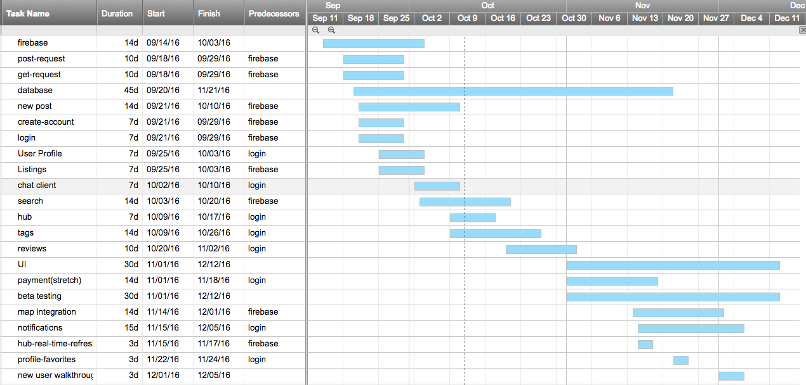
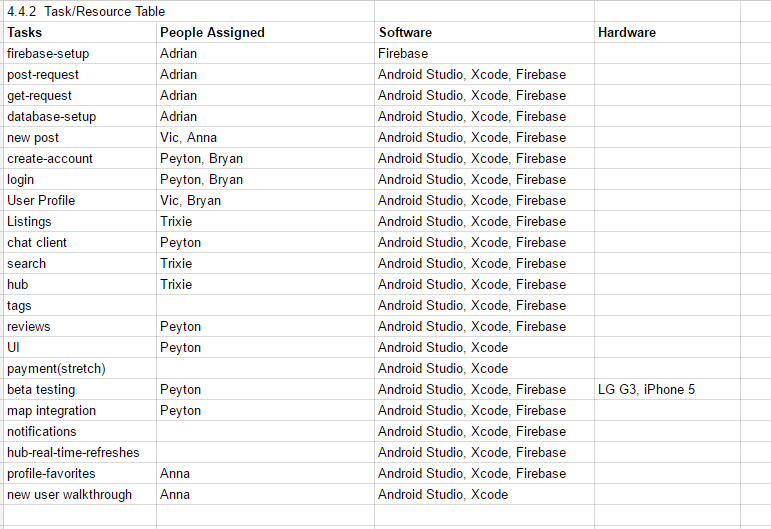

# 4.0 Software Development Plan

## 4.1 Plan Introduction
MarkIt is an application that aims to bridge the gap between buyers and sellers within a college community by providing them with a means of direct communication. Within the application, users will be able to search, sell, purchase, post, and track goods. The distinction between MarkIt and other similar existing applications is its exclusive availability to verified college students when they signup using a valid .edu email address. MarkIt will be accessible through Android and iOS devices as well as through web browsers. In developing the application, the tasks required for each project member compose of becoming familiar with the database (i.e., Firebase) for storing and retrieving data about users and items, learning the language needed for developing in each (i.e., Swift for iOS, Java for Android, and JavaScript for web), and collaboratively creating the user interface for each of the three platforms mentioned above and implementing a robust search functionality. 

Within the scope of using Firebase, each member should accomplish the following tasks by the designated deadlines:
-   Post-request (09/29)
-   Get-request (09/29)
-   Login/Sign-up (09/29)
-   User Profiles (10/03)
-   Reading Listings (10/03)
-   Creating a New Post (10/10)

Creating the user interface should be accomplished by the following deadlines:
-   Chat Client (10/03)
-   Hub Page (10/17)
-   Searching Items (10/20)
-   Tagging Items (10/26)
-   Reviews (11/02)
-   Map Integration (12/01)
-   Notifications (12/05)

Testing the product should be accomplished by the following date:
-   Beta Testing (12/12)
-   MVP User Interface (12/12)

### 4.1.1 Project Deliverables
The following items are to be delivered to the customer:
-   Project Proposal Document (9/14)
  - This document will introduce our project and will give a description and justification for it. 
-   Requirements Specification (9/28)
  - This document will detail the low-level requirements of our project.
-   Software Development Plan (10/12)
  - This document will define the process and resources that will be used during the semester to produce all the required documents and software.
-   Architecture Design Description (10/19)
  - This document will present the overall architecture of the software system by specifying the system components and their interrelationships.
-   Software Design Description (11/9)
  - This document will completely explain all the details of all the different attributes of the software we are developing. 
-   Test and Integration Plan (11/23)
  - This document will outline the software development process which will be used to create the required system. This document also overviews our software testing strategies we will be using. 
-   Preliminary User's Manual (11/30)
  - This document will be a first draft of the user's manual and will describe how to use our product.
-   User's Manual (12/7)
  - This document will be the final draft of the user's manual and will clearly explain how to install and operate our final product.
-   Final Project Presentation (12/14)
  - This presentation will outline our team's final product and the process it took to make it.
-   Oral Status Reports
  - These reports will help tell the customer our team's progress with our project and deliverables.
-   Written Status Reports in Project SDF
  - These reports will notify the customer of our status in the project SDF.

## 4.2 Project Resources

### 4.2.1 Hardware Resources

| Operating System | CPU Name      | CPU speed | # of CPU Cores | Amount of Ram | Name of GPU             | Amount of VRAM | Purpose     |
|:----------------:|---------------|-----------|----------------|---------------|-------------------------|----------------|-------------|
| Windows          | Intel Core i7 | 2.4 GHz   | 2 Cores        | 8 GB          | Intel HD Graphics       |     128 MB     | Development |
| Windows          | Intel Core i7 | 2.3 GHz   | 4 Cores        | 16 GB         | Intel Iris Pro          | 1536 MB        | Development |
|        OSX       | Intel Core i5 | 1.3 GHz   | 2 Cores        | 4 GB          | Intel HD Graphics 5000  | 1536 MB        | Development |
| OSX              | Intel Core i5 | 2.5 GHz   | 4 Cores        | 4 GB          | Intel HD Graphics 4000  | 1536 MB        | Development |
| OSX              | Intel Core i5 | 1.4 GHz   | 2 Cores        | 4 GB          | Intel HD Graphics 5000  | 1536 MB        | Development |
| Windows          | Intel Core i7 | 2.6 GHz   | 4 Cores        | 16 GB         | NVIDIA GeForce GTX 960  | 2 GB           | Development |
| Windows          | Intel Core i7 | 3.75 GHz  | 4 Cores        | 16 GB         | ASUS ROG Strix GTX 1080 | 8 GB           | Development |
| OSX              | Intel Core i5 | 2.5 GHz   | 4 Cores        | 8 GB          | Intel HD Graphics 4000  | 1536 MB        | Development |

| Operating System | Model     | Purpose |
|:----------------:|-----------|---------|
| iOS              | iPhone 6  | Testing |
| Android          | LG G3     | Testing |
| Android          | OnePlus 2 | Testing |

### 4.2.2 Software Resources

| Team    | Software Used                                                                        | 
|---------|--------------------------------------------------------------------------------------|
| Android | Android Studio, Firebase, Sublime Text Editor                                        |   
| iOS     | CocoaPods, Firebase, Sublime Text Editor, Xcode                                      |   
| Webapp  | Angular, Firebase, jQuery, Materialize, Node, Python, Sublime Text   Editor, Webpack |   

## 4.3 Project Organization
Members of this project will be split into three categories: project lead, team lead, and team member. Each position inheriting all the responsibilities of the one below it. The project is also divided into three teams: web, android, and iOS. A member of any given team is expected to contribute to that team’s individual section of the project. For example, in the case of the iOS team, that would mean contributing to the iOS app the team is developing for the project. Each team will also have a team lead, a moderator who, in addition to contributing to the project on his or her own, will delegate work to his or her self as well as the team members. Team leads are also expected to host scrum meetings on a weekly basis with his or her team. The project lead presides over the team leads and serves as a central hub for information on the project. The project lead will direct the team leads as well as act as a member of a team. In addition, the project lead will host a project scrum consisting of every member of every team on the project.

## 4.4 Project Schedule
Each team will work on their respective parts of the application but all teams should be on the same page of what is completed each week. We have a list of features that must completed for a minimum viable product which are detailed in the GANTT Chart. 
The task and resource table outlines who's completing what and with what hardware and software they will be using.

### 4.4.1 PERT/GANTT Chart

To view the GANTT chart on a web browser, click [here](https://app.smartsheet.com/b/publish?EQBCT=46900f28d4b547f59686940dc4521edb)

### 4.4.2 Task/Resource Table

### 4.4.3 Class Schedule
10.12.2016 
-   Software Developement Plan document due. 
-   Full team meeting (scrum). Meeting place: Kecklab.
-   Assign Software Design Description document.
-   Unit and Integration Test

10.13.2016 
-   Android Team meeting (Kecklab). 
-   iOS team meeting (Kecklab).

10.15.2016 
-   Android team scrum/code day (Kecklab)

10.16.2016 
-   Full team scrum (Kecklab)

Work on Software Design document

10.18.2016 
-   Android team meeting

10.19.2016 
-   Software Design description due
-   Full team meeting/scrum  (Kecklab)
-   Preliminary Design Review presentation assigned
-   Special Guest Speak: Daniel Manchala

10.20.2016 
-   Android team meeting  (Kecklab)
-   iOS team meeting (Kecklab) 

10.22.2016 
-   Android team scrum/code day (Kecklab)

10.23.2016 
-   Full team scrum (Kecklab) 

10.25.2016 
-   Android team meeting (Kecklab)

10.26.2016 
-   Preliminary Design Review presentation 
-   Project status update
-   Full team meeting/scrum (Kecklab)

10.27.2016 
-   iOS team meeting/scrum (Kecklab)

10.29.2016 
-   Android team scrum/code day (Kecklab)

10.30.2016 
-   Full team scrum (Kecklab) 

11.01.2016 
-   Android team meeting

11.02.2016 
-   Project status update
-   Software Design Description document completion assigned
-   Critical Design Review presentation assigned
-   Full team scrum/code day (Kecklab) 

11.03.2016 
-   iOS team scrum (Kecklab)
-   Android team meeting (Kecklab)

11.05.2016 
-   Android team scrum/code day (Kecklab) 

11.06.2016 
-     Full team scrum/code day (Kecklab)

11.09.2016 
-   Software Design Description document completion due
-   Critical Design Review presentation
-   Full team scrum (Kecklab) 

11.10.2016 
-   iOS team scrum (Kecklab) 
-   Android team meeting (Kecklab) 

11.12.2016 
-   Android team scrum/code day (Kecklab) 

11.13.2016 
-   Full team scrum/code day (Kecklab) 

11.16.2016 
-   Alpha Project presentations assigned
-   Test and Integration Plan document assigned
-   Special Guest Speaker
-   Full team scrum/code day (Kecklab)

11.17.2016 
-   Android team meeting (Kecklab)
-   iOS team scrum (Kecklab)

11.19.2016 
-   Android team scrum/code day (Kecklab)

11.20.2016 
-   Full team scrum/code day (Kecklab) 

11.23.2016 
-   Alpha Project presentation
-   Test and Integration Plan document due
-   Full team scrum/code day (Kecklab)
-   Beta Project Presentation assigned 
-   Configuration Management Plan document assigned

11.24.2016 
-   iOS team scrum (Kecklab)
-   Android team meeting (Kecklab)

11.26.2016 
-   Android team scrum/code day  (Kecklab)

11.27.2016 
-   Full team scrum/code day (Kecklab) 

11.30.2016 
-   Beta Project Presentation
-   Configuration Management Plan document due
-   Full team scrum/code day (Kecklab) 

12.01.2016 
-   iOS team scrum (Kecklab)
-   Android Team meeting (Kecklab)

12.03.2016 
-   Android scrum/code day (Kecklab) 

12.04.2016 
-   Full team scrum/code day (Kecklab)

12.07.2017 
-   Peer Code Review 
-   Final User’s Manual Updates assigned
-   Final SDF Submission assigned
-   Full team scrum/code day (Kecklab)

12.08-15.2016 
-   Final adjustments/additions/touches to all aspects of the project
-   Preparation for final presentation
-   Schedule most likely will become more busy during this time. 
